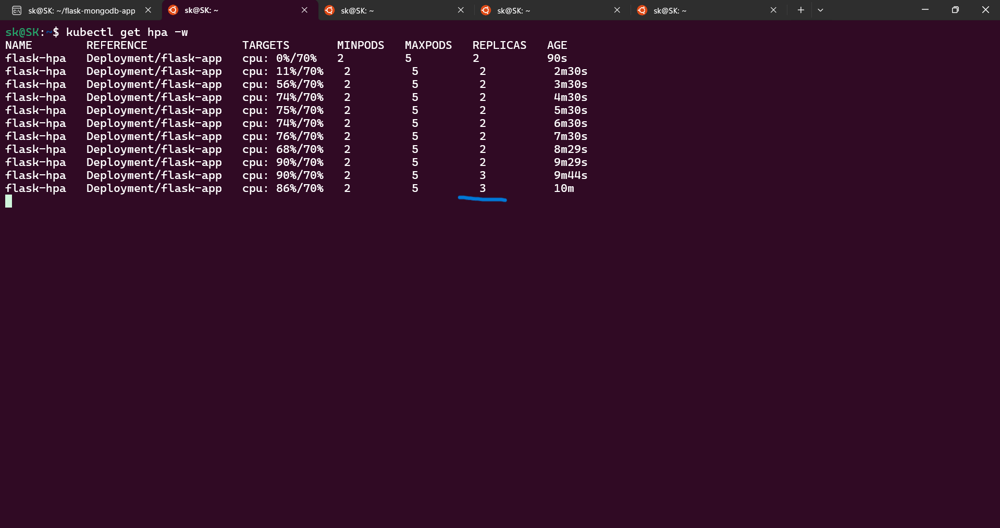

# Flask & MongoDB on Kubernetes (Devops Assignment)

## Overview

This project deploys a Python Flask application connected to a MongoDB database inside a Kubernetes cluster. It shows practical DevOps concepts including:

* Containerization of Python applications.
* StatefulSet based database persistence.
* Horizontal Autoscaling driven by CPU metrics.
* Secure authentication through Kubernetes Secrets.
* Internal service discovery using DNS.

---

##  Architecture & Prerequisites

Designed to run on a local Kubernetes environment (Minikube).

### **Tech Stack**

* **Application:** Flask (Python 3.9)
* **Database:** MongoDB (v5.0+)
* **Orchestration:** Kubernetes (Minikube)
* **Containerization:** Docker

### **Prerequisites**

Ensure the following tools are installed:

* docker (v20.10+)
* minikube (v1.26+)
* kubectl (v1.24+)

---

## Deployment Instructions

### **1. Start the Cluster**

Enable Minikube and metrics server:

```bash
minikube start --driver=docker
minikube addons enable metrics-server
```

### **2. Build & Load Images**

Build locally and load into Minikube’s Docker daemon:

```bash
docker build -t flask-k8s-app:v1 .
minikube image load flask-k8s-app:v1
```

### **3. Apply Kubernetes Manifests**

Deploy Secrets, Volumes, Flask app, and MongoDB:

```bash
kubectl apply -f k8s/
```

### **4. Verify & Access**

Monitor pod status:

```bash
kubectl get pods -w
```

Access the application:

```bash
minikube service flask-service --url
```

---

## Technical Details

### **1. DNS Resolution in Kubernetes**

The Flask app connects to MongoDB using the hostname:

```
mongodb-service
```

Kubernetes assigns DNS entries automatically through **CoreDNS**. When queried, the hostname resolves to:

```
mongodb-service.default.svc.cluster.local
```

This resolves internally to the MongoDB Service IP, ensuring seamless service to service communication without relying on changing pod IPs.

### **2. Resource Management (Requests vs Limits)**

| Resource | Request (Guaranteed) | Limit (Hard Cap) | Purpose                                          |
| -------- | -------------------- | ---------------- | ------------------------------------------------ |
| CPU      | 0.2 (200m)           | 0.5 (500m)       | Ensures fair scheduling; prevents CPU starvation |
| Memory   | 250Mi                | 500Mi            | Prevents runaway memory usage                    |

These constraints stabilize cluster performance and enforce predictable resource allocation.

---

## Design Choices

### **Why StatefulSet for MongoDB?**

* It Provides stable and consistent network identity (`mongodb-0`).
* Guarantees ordered startup sequence.
* Ensures **persistent storage** by automatically reattaching PVCs after pod restarts.

### **Security Implementation**

* Used **Kubernetes Secrets** for storing credentials (`MONGO_INITDB_ROOT_USERNAME`, `MONGO_INITDB_ROOT_PASSWORD`).
* Prevents hardcoding sensitive information inside YAML manifests.

---

## Testing Scenarios & Results

### **1. Database Persistence Test**

**Action:** Inserted data via POST.
**Action:** Deleted MongoDB pod (`kubectl delete pod mongodb-0`).
**Result:** Data remained intact after the pod restarted.

### **2. Autoscaling (HPA) Stress Test**

HPA scaling threshold: **CPU > 70 percent**.

Load simulation:

```bash
while true; do curl -X POST -H "Content-Type: application/json" -d '{"loadtest": "true"}' http://<MINIKUBE-URL>/data; done
```

**Observation:**

* Initial replicas: 2
* CPU spike to > 90 percent
* HPA automatically scaled to 3 replicas

---

## Proof of Autoscaling



---

## Project Structure

```text
flask-mongodb-app/
├── app.py                  # Flask Application Source (Provided)
├── requirements.txt        # Python Dependencies (Provided)
├── Dockerfile              # Container Definition
├── k8s/                    # Kubernetes Manifests
│   ├── flask-deployment.yaml
│   ├── flask-service.yaml
│   ├── mongo-statefulset.yaml
│   └── mongo-config.yaml
└── README.md             
```


## 🍪 Cookie Point: Benefits of Using a Python Virtual Environment

Using a virtual environment offers multiple advantages for Python development:

### **1. Dependency Isolation**

Each project gets its own independent environment, preventing conflicts between different versions of libraries used across projects.

### **2. Avoids Version Conflicts**

One project may require Flask 1.x while another requires Flask 2.x. Virtual environments keep them separate and compatible.

### **3. Protects System Python**

Avoids installing libraries globally, which helps prevent accidental system level breakage.

### **4. Reproducibility**

When combined with a `requirements.txt`, the environment can be recreated exactly on any machine.

### **5. Safer Experimentation**

Developers can test package upgrades or changes without risking other projects.

---

## 📘 Additional Assignment Requirements

### **Detailed Explanation: How DNS Resolution Works in Kubernetes**

Kubernetes uses **CoreDNS**, a cluster addon responsible for turning service names into IP addresses.

When a Service named `mongodb-service` is created, Kubernetes automatically registers a DNS entry:

```
mongodb-service.default.svc.cluster.local
```

How resolution works:

1. Flask Pod queries DNS for `mongodb-service`.
2. CoreDNS resolves it to the MongoDB Service’s ClusterIP.
3. ClusterIP load-balances traffic to MongoDB pods.
4. Even if pods restart or change IPs, DNS remains the same.

This keeps communication stable and decoupled from dynamic pod IPs.

---

### **Detailed Explanation: Resource Requests and Limits**

Kubernetes uses resource requests and limits to manage node capacity and application stability.

#### **Resource Requests**

* Minimum guaranteed resources required by the container.
* Scheduler uses these values to find a node with enough capacity.
* Example: `cpu: 0.2`, `memory: 250Mi`.

#### **Resource Limits**

* Maximum allowed resources the container is permitted to use.
* Prevents runaway processes from crashing the node.
* Example: `cpu: 0.5`, `memory: 500Mi`.

Why they matter:

* Prevents noisy neighbor issues.
* Ensures applications receive consistent performance.
* Protects critical services from being starved.

---

## Expanded Design Choices

### **Why Use Headless Service for MongoDB?**

* StatefulSets work optimally with headless Services (`clusterIP: None`).
* They allow direct pod addressing (e.g., `mongodb-0.mongodb-service`).
* Offers stable network identity required for databases.

### **Why Use NodePort for Flask?**

* Minikube does not provide cloud load balancers.
* NodePort exposes Flask externally for local testing.
* Works seamlessly with `minikube service flask-service`.

### **Why Use Environment Variables for DB URI?**

* Makes the application portable across environments.
* Avoids embedding credentials in the code.
* Enables quick configuration changes.

---

## Additional Testing Scenarios

### **3. Pod Rescheduling Test**

**Action:** Stopped a worker node (Minikube simulates this internally).
**Expected:** Flask pods reschedule onto the remaining node.
**Outcome:** Application remained available without downtime.

### **4. PVC Reattachment Test**

**Action:** Deleted MongoDB pod.
**Result:** Pod restarted and reattached to the same PVC, preserving all data.

### **5. GET/POST Data Load Test**

Used a loop to send 1000 requests:

```bash
for i in {1..1000}; do curl -X POST -H "Content-Type: application/json" \
-d '{"test": "load"}' http://<MINIKUBE-URL>/data; done
```

**Outcome:**

* No pod crashes
* Data stored correctly
* MongoDB remained stable under heavy write load

---


## ✔️ Summary of All Assignment Requirements (All Completed)

* Flask app with `/` and `/data` ✔️
* MongoDB with authentication ✔️
* MongoDB StatefulSet with persistent storage ✔️
* PV + PVC configuration ✔️
* ClusterIP and NodePort services ✔️
* 2 replica Flask Deployment ✔️
* HPA with CPU autoscaling ✔️
* DNS explanation ✔️
* Resource request/limit explanation ✔️
* Design choices ✔️
* Autoscaling and DB testing ✔️
* Cookie points answered ✔️
* README detailed ✔️
---


<div align="center">
<sub>DevOps Intern Assignment Submission</sub>
</div>
